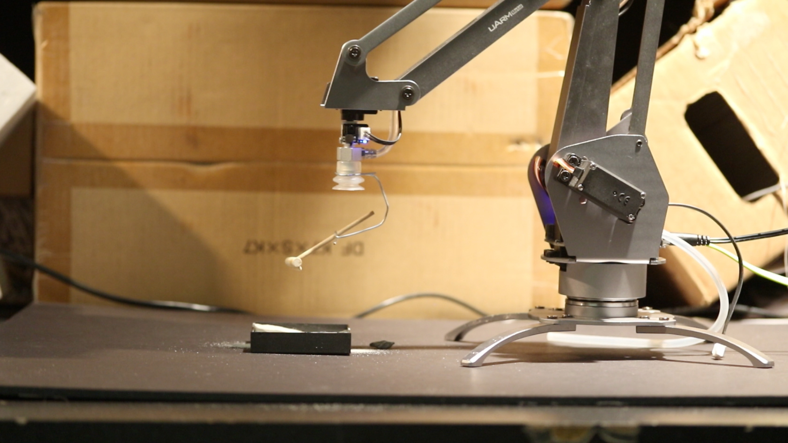

# Zenbot (client app)

Zenbot is a zen garden that you can interact with remotely via a robotic arm holding a small rake.

This OpenFrameworks app provides the control interface for the arm; moving a mouse around the window will cause the arm to move on the X/Y axis, while clicking and releasing moves the arm up and down.

This application alone will not move the arm; it must run in conjunction with [the server-side app](https://github.com/dansakamoto/zenbot-server).

This app includes [the ofxOsc addon by Hideyuki Saito](https://github.com/hideyukisaito/ofxOsc).